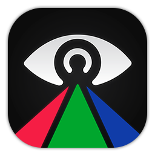
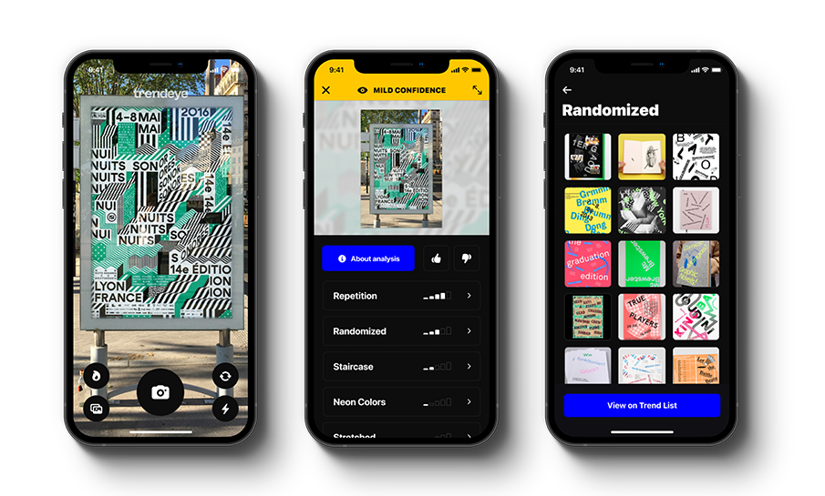

     

<h1 align="center">Trendeye (Beta)</h1>

Experimental graphic design trend classification on iOS powered by Vision, CoreML, and over 14,000 images featured in <a href="https://www.trendlist.org">TrendList.org</a>

## Authors

- [@roz0n](https://www.rozon.org/)

> Design, mobile development, backend development, deployment, testing, and everything in-between. I am not a machine learning engineer — just an enthusiast.

## Screenshots

     

## Architecture

**Frontend:** Swift, UIKit (fully programmatic), AVKit, Vision, CoreML

**Backend:** TypeScript, Node, MongoDB Atlas, Redis, Express (namely [JSDOM](https://github.com/jsdom/jsdom) and Node's [Stream API](https://nodejs.org/api/stream.html#stream_stream) for image scraping, tagging, and saving)

> For more information about the Trendeye backend, kindly visit the [Unofficial TrendList API](https://github.com/roz0n/trendlist-api) repo though it's currently undocumented.

**Deployment:** ~~Digital Ocean, Terraform~~ Heroku (for simplicity 😉 )

**Design:** Figma, Adobe Illustrator

## Background

[TrendList.org](https://www.trendlist.org) was founded by **Michal Sloboda** and **Ondřej Zita** in 2011 and has been featured in renowned publications such as [It's Nice That](https://www.itsnicethat.com/features/trend-list-graphic-design-trends-2020-preview-of-the-year-2020-opinion-060120) and [AIGA Eye on Design](https://eyeondesign.aiga.org/the-trick-to-predicting-2016s-graphic-design-trends/). The aim of the portal, in the words of the founders:

> "Trend List was a reaction to ever-present formalism and the repetitive visual language in the works that we saw online. … We wanted to catalogue this to see if there are patterns in visual trends and how those evolve over time. In the early days, we received hate emails and requests of removal, but it soon changed. Over the years Trend List became a benchmark, a reference database and a source of inspiration for up-and-coming designers. Now there are designers submitting their own creations to Trend List daily."

## Features

Trendeye leverages [Vision](https://developer.apple.com/documentation/vision) and [CoreML](https://developer.apple.com/documentation/coreml) to analyze a given image and infer _multiple_ trends that may be present, to some degree, in a given piece of graphic design work. The image classification model was trained by over **14,000** images present in the Trend List catalogue.

When launched, the app starts a thoroughly configured [`AVCaptureSession`](https://developer.apple.com/documentation/avfoundation/avcapturesession) that supports custom implementations of features commonly found in popular camera-based apps such as Instagram and Snapchat: tap-to-focus, pinch-to-zoom, and flash and torch toggling. Likewise, the user can select an image from their gallery using [`UIImagePickerController`](https://developer.apple.com/documentation/uikit/uiimagepickercontroller).

Upon classification, users can learn more about a specific trend by tapping its cell. Examples of the trend are presented in a [`UICollectionView`](https://developer.apple.com/documentation/uikit/uicollectionview) grid and a link is provided to view trend's page on Trend List via a [`WKWebView`](https://developer.apple.com/documentation/webkit/wkwebview). The image grid is powered by the [Unofficial TrendList API](https://github.com/roz0n/trendlist-api) which, amongst other things, is a complete RESTful API of the entire Trend List catalogue.

### Training the Model for Improved Accuracy

Users can choose to provide feedback regarding the accuracy of the analysis and help train the model. As it stands, a user feedback report is a JSON payload that consists of the following:

| Property                | Type             | Description                                                                                                                                                 |
| :---------------------- | :--------------- | :---------------------------------------------------------------------------------------------------------------------------------------------------------- |
| `type`                  | `String`         | Either `"positive"` or `"negative"`                                                                                                                         |
| `classificationResult`  | `String`         | The classification's [`VNClassificationObservation`](https://developer.apple.com/documentation/vision/vnclassificationobservation) encoded to a JSON string |
| `classifiedIdentifiers` | `[String: Bool]` | Trends identified by the model that may be inaccurate                                                                                                       |
| `correctIdentifiers`    | `[String]?`      | Trends the user has identified as more accurate representations of the given image or `nil` if `type` is `"positive"`                                       |
| `date`                  | `Date`           | A UTC timestamp of the analysis                                                                                                                             |
| `deviceId`              | `String`         | An anonymous, unique identifier of the user's device                                                                                                        |

Once submitted, the feedback report is stored in the cloud via MongoDB Atlas for further processing with CoreML.

## Roadmap

- Deploy to AppStore (currently available via TestFlight only)
- Continually improve the accuracy of the image classification model
- Implement custom cropping

## Run on a Physical Device

Because Trendeye relies on [`AVCaptureSession`](https://developer.apple.com/documentation/avfoundation/avcapturesession) it will not work inside a simulator without significant modifications to the [`CameraViewController`](https://github.com/roz0n/Trendeye/blob/master/Trendeye/Controllers/CameraViewController.swift) class. You will need to install it on a physical device to build it from source.

The project follows traditional iOS development conventions in the event you'd like to do so.

1. Clone the repo and open the project.
2. Select the app target in the Xcode's project navigator.
3. Select the `Signing & Capabilities` tab.
4. Change the team from the dropdown menu to your own developer account.
5. Build the app: `⌘ + R`

## Acknowledgements

- [TrendList.org](https://www.trendlist.org/) and its founders Michal Sloboda and Ondřej Zita.
- The legion of remarkably talented designers, artists, and studios, that have had their work cataloged on the [Trend List](https://www.trendlist.org) blog.

Thank you.

## Contact Me

For support, bug reports, inquiries, or a stern talking to, email [arnold@rozon.org](mailto:arnold@rozon.org)

## License

Trendeye is entirely ad-free, open-source, and will be in perpetuity.

[MPL-2.0 License](https://choosealicense.com/licenses/mpl-2.0/)
