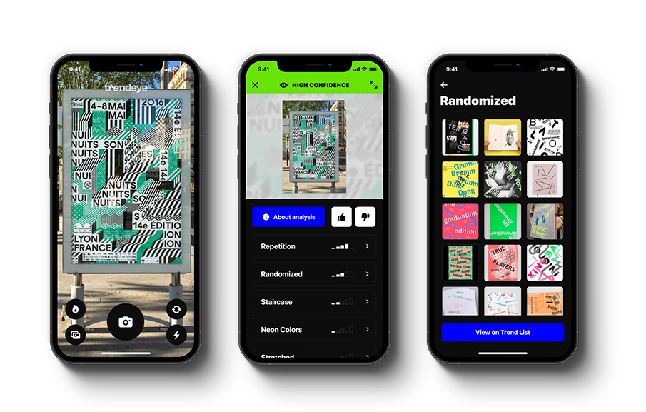

     

<h1 align="center">Trendeye (Beta)</h1>

Experimental graphic design trend classification on iOS powered by Vision, CoreML, and over 15,000 images featured in <a href="https://www.trendlist.org">TrendList.org</a>

## Screenshots

     

## Background

[TrendList.org](https://www.trendlist.org) was founded by **Michal Sloboda** and **Ondřej Zita** in 2011 and has been featured in renowned publications such as [It's Nice That](https://www.itsnicethat.com/features/trend-list-graphic-design-trends-2020-preview-of-the-year-2020-opinion-060120) and [AIGA Eye on Design](https://eyeondesign.aiga.org/the-trick-to-predicting-2016s-graphic-design-trends/). The aim of the portal, in the words of the founders:

> "Trend List was a reaction to ever-present formalism and the repetitive visual language in the works that we saw online. … We wanted to catalogue this to see if there are patterns in visual trends and how those evolve over time. In the early days, we received hate emails and requests of removal, but it soon changed. Over the years Trend List became a benchmark, a reference database and a source of inspiration for up-and-coming designers. Now there are designers submitting their own creations to Trend List daily."

## Motivation

Trendeye is an attempt to leverage Vision and CoreML's image classification APIs to identify experimental trends contained in a given piece of design work.

For the better part of the last decade, Trend List has been a staple in my bookmarks toolbar as a point of reference for inspiration while also being useful to keep up with burgeoning graphic design trends. Though the editors do a good job of categorizing submissions within individual trends, I find that many works are often contain *multiple* ones.

Image classification is tricky and the degree of precision required to achieve the desired results increase further when dealing with heavily text-based images. While early results have been promising, it's clear that there is still work to be done tuning the classification model for accuracy.

None the less, Trendeye occupies and interesting space at the intersection of artificial intelligence and graphic design, demonstrating that modern computing is perhaps now at a stage capable of interpreting the deep subtleties of one of the most rigid human art forms.

## To-Do

- Continually improve the accuracy of the image classification model
- Add unit and UI tests
- Custom image cropping
- Deploy to AppStore (currently available via TestFlight only)

## Running the App

Because Trendeye relies on [`AVCaptureSession`](https://developer.apple.com/documentation/avfoundation/avcapturesession) it will not run on a simulator without refactoring aspects of the [`CameraViewController`](https://github.com/roz0n/Trendeye/blob/master/Trendeye/Controllers/CameraViewController.swift) class. You will need to install it to a physical device in order run it locally. The project follows traditional iOS development conventions in the event you'd like to do so (albeit with limited functionality):

1. Clone the repo and open the project.
2. Select the main app target in the Xcode's project navigator.
3. Select the `Signing & Capabilities` tab.
4. Change the `Team` from the dropdown menu to your own.
5. Build the app: `⌘ + R`

## Architecture

**Mobile:** Swift, UIKit, AVKit, Vision, CoreML

**Backend:** TypeScript, Node, MongoDB Atlas, Redis, Express (namely [JSDOM](https://github.com/jsdom/jsdom) and Node's [Stream API](https://nodejs.org/api/stream.html#stream_stream) for image scraping, tagging, and storing)

> For more information about the Trendeye backend, kindly visit the [Unofficial TrendList API](https://github.com/roz0n/trendlist-api) repo though it's currently undocumented.

**Deployment:** Heroku

**Design:** Figma, Adobe Illustrator

## Authors

- [@roz0n](https://www.rozon.org/)

> Design, mobile development, backend development, deployment, and testing. I am not a machine learning engineer, just an enthusiast.

## Acknowledgements

- [TrendList.org](https://www.trendlist.org/) and its founders Michal Sloboda and Ondřej Zita.
- The legion of remarkably talented designers, artists, and studios, that have had their work cataloged on the [Trend List](https://www.trendlist.org) blog.

## Contact Me

For support, bug reports, inquiries, or a stern talking to, email [arnold@rozon.org](mailto:arnold@rozon.org)

## License

[MPL-2.0 License](https://choosealicense.com/licenses/mpl-2.0/)
