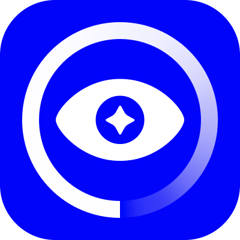

<p align="center" width="100%">
     
</p>

# Trendeye (Beta)
Graphic design trend classification powered by CoreML and images from [TrendList.org](https://www.trendlist.org)

## Authors
- [@roz0n](https://www.linkedin.com/in/rozon)
| Design, Development, Deployment, Testing

## Screenshots


## Tech Stack
**Client:** Swift, UIKit (fully programmatic MVC, zero storyboards or nibs), AVKit, CoreML

**Server:** TypeScript, Node, Express (namely `JSDOM` and Node [Stream API](https://nodejs.org/api/stream.html#stream_stream) for web and image scraping respectively), Redis

For more information about the Trendeye backend, please see [Unofficial TrendList API](https://github.com/roz0n/trendlist-api)

**Deployment:** Terraform, Docker, Ubuntu (via DigitalOcean), NGINX

**Design:** Figma, Adobe Illustrator

To view complete designs, please see [this Figma project](https://www.figma.com/file/yb2EerWCmNrCjhuYVYR150/TRENDEYE-iOS-App?node-id=321%3A582)

## Notable Features
Trendeye is a simple app with a simple purpose but contains some interesting UX goodies built from the ground up:

- Snapchat-style full-screen camera view input powered by AVKit (namely `AVCaptureSession`)
- Instagram-style image panning and zooming (built by leveraging `UIPanGestureRecognizer` and `UIPinchGestureRecognizer` in tandem)
- Stretchy table headers (using a modified version of Michael Nachbaur's eloquent [solution](https://nachbaur.com/2020/05/06/stretchable-tableview-header/))

Most importantly, the above was accomplished without a single third-party dependency. Though in some ways I wish I had used them as I encountered many UIKit bugs along the way 🌝

## Roadmap
- *Greatly* improve the accuracy of the image classification model
- Implement photo framing and cropping using `UIGraphicsImageRenderer`
- Persist classification results on the device using CoreData and sync them with `CloudKit`

## Run Locally
Clone the project

```bash
  git clone https://link-to-project
```

Go to the project directory

```bash
  cd my-project
```

Install dependencies

```bash
  npm install
```

Start the server

```bash
  npm run start
```

## Running Tests
To run tests, run the following command

```bash
  npm run test
```

## Acknowledgements
 - [Trend List](https://www.trendlist.org/)
 - [Indian Type Foundry](https://www.indiantypefoundry.com/)
 - [FontShare](https://www.fontshare.com/)

 ... and most notably, the legion of talented designers/artists/studios that have had their work catalogued on the (Trend List)[https://www.trendlist.org] blog. Thank you.

## Contact Me
For support, bug reports, inquiries, or a stern talking to, email arnold@rozon.dev

## License
[MIT](https://choosealicense.com/licenses/mit/)